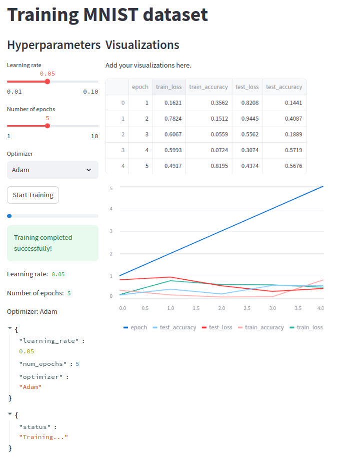

This is GUI Web Application for Machine Learning Experiments tracking and management

# Table of Contents
- [Table of Contents](#table-of-contents)
  - [Introduction](#introduction)
  - [Installation](#installation)
  - [Usage](#usage)
  - [Architecture](#architecture)
    - [Database](#database)
  - [Training MNIST process](#training-mnist-process)
    - [Backend](#backend)
    - [Frontend](#frontend)
    - [Worker](#worker)
  - [Development](#development)

## Introduction

This is a simple web application for managing machine learning experiments. It allows users to define hyperparameters for a machine learning model and run multiple jobs with different hyperparameters. The application displays the progress of currently running jobs and the results of all finished jobs. The experiments can be sorted by a pre-defined metric (e.g. accuracy, run time) for ease of comparison. The application also allows users to resume the UI and add new jobs.
<!-- % adding a figure 'demo.png' here -->


## Installation
To install the application, follow these steps:
```bash
git clone https://github.com/mtuann/gui-ml-track.git
cd gui-ml
pip install -r requirements.txt
streamlit run frontend.py
```

## Usage

## Architecture
GUI-ML is a web application built with Streamlit, a Python library for creating web applications. The application uses Redis as a database to store the job status and experiment results. The application uses Celery, a distributed task queue, to run the machine learning jobs with the specified hyperparameters.


### Database

Define the class `RedisDB` at `redis_db.py`. This class provides a simple interface for interacting with the Redis database. It provides methods for adding, updating, and retrieving job status and experiment results.

Maintain the queue database: `queue:requests` to store the job status and experiment results.

Simple training hyperparameters format:
```json
hyper_params = {
    "optimizer": "adam",
    "learning_rate": 0.001,
    "num_epochs": 5
}
```
When client sends a request training to server, the server will add the request to the queue database `queue:requests` with the following format:
```json
data = {
  'iid': iid, # generated by server using uuid library
  'hyper_params': hyper_params,
  'status': 'waiting',
  'in_update': [],
}
```
The `status` field is used to track the status of the job. The list of possible status values is `['waiting', 'running', 'done']`.

The `in_update` field is used to store the intermediate results of the job. It has the following format:
```json
meta_data = {
  "train_loss": [],
  "train_accuracy": [],
  "test_loss": [],
  "test_accuracy": [],
  "time_training": [],
  "epoch": [],
}
```

## Training MNIST process
The training process is implemented in `train_minist.py`. In this file, we define data loading, model architecture, training loop, and evaluation. The training process is implemented in the `training_and_update` function. This function takes the hyperparameters as input and returns the training and test loss and accuracy. The training process is implemented using PyTorch, a popular machine learning library for Python.
The parameters of `training_and_update` function are:
- `train_params`: the hyperparameters for the training process
- `rdb`: the Redis database to store the job status and experiment results
- `rdb_item`: the Redis database item to store the job status and experiment results
In each training epoch, the function will update the `in_update` field of the job status in the Redis database with the intermediate results of the job. This allows the frontend to display the progress of the currently running jobs.  


### Backend
The backend is built with Flask, a Python web framework. It provides a RESTful API for the frontend to interact with the database and the worker. The backend is responsible for updating the job status and experiment results in the database and for starting and stopping the worker.


### Frontend
The frontend is built with Streamlit, a Python library for creating web applications. It provides a user interface for users to define hyperparameters for a machine learning model and run multiple jobs with different hyperparameters. The frontend displays the progress of currently running jobs and the results of all finished jobs. The experiments can be sorted by a pre-defined metric (e.g. accuracy, run time) for ease of comparison. The frontend also allows users to resume the UI and add new jobs.

### Worker
The worker is a simple Python script that checks the database for new jobs and runs the machine learning jobs with the specified hyperparameters.


## Development
To run the application in development mode, follow these steps:
1. Clone the repository
2. Install the required dependencies
3. Start the backend
```bash
python backend.py
```
4. Start the worker
```
python worker.py
```
5. Start the frontend
```
streamlit run frontend.py
```