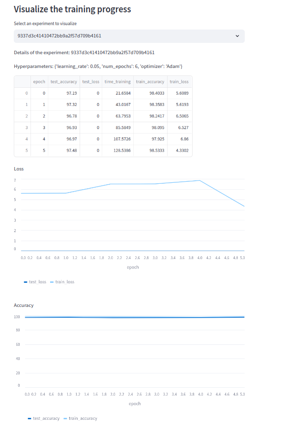

This is GUI Web Application for Machine Learning Experiments tracking and management

# Table of Contents
- [Table of Contents](#table-of-contents)
  - [Introduction](#introduction)
  - [Application Structure](#application-structure)
    - [Database](#database)
    - [Training MNIST process](#training-mnist-process)
    - [Backend](#backend)
    - [Worker](#worker)
    - [Frontend](#frontend)
  - [Deployment](#deployment)
  


## Introduction

This is a simple web application for managing machine learning experiments. It allows users to define hyperparameters for a machine learning model and run multiple jobs with different hyperparameters. The application displays the progress of currently running jobs and the results of all finished jobs. The experiments can be sorted by a pre-defined metric (e.g. accuracy, run time) for ease of comparison. The application also allows users to resume the UI and add new jobs.


The visualization of the application is shown in the figure below:


<!-- ## Installation
To install the application, follow these steps:
```bash
git clone https://github.com/mtuann/gui-ml-track.git
cd gui-ml
pip install -r requirements.txt
streamlit run frontend.py
``` -->

## Application Structure
The main components of the application are:
- **Database**: Redis, a popular in-memory database, is used to store the job status and experiment results.
- **Backend**: Flask, a Python web framework, is used to provide a RESTful API for the frontend to interact with the database and the worker.
- **Worker**: Python script, checks the database for new jobs and runs the machine learning jobs with the specified hyperparameters.
- **Frontend**: Streamlit, a Python library for creating web applications, is used to provide a user interface for users to define hyperparameters for a machine learning model and run multiple jobs with different hyperparameters.

### Database

Define the class `RedisDB` at `redis_db.py`. This class provides a simple interface for interacting with the Redis database. It provides methods for adding, updating, and retrieving job status and experiment results.

The default value is `redis://localhost:6379` and the default database is `0`. You can change this value to connect to a different Redis database.

Maintain the queue database: `queue:requests` to store the job status and experiment results.

Simple training hyperparameters format:
```json
hyper_params = {
    "optimizer": "adam",
    "learning_rate": 0.001,
    "num_epochs": 5
}
```
When client sends a request training to server, the server will add the request to the queue database `queue:requests` with the following format:
```json
data = {
  "iid": iid, # generated by server using uuid library
  "hyper_params": hyper_params,
  "status": "waiting",
  "in_update": [],
}
```
The `status` field is used to track the status of the job. The list of possible status values is `['waiting', 'running', 'done']`.

The `in_update` field is used to store the intermediate results of the job. It has the following format:
```json
meta_data = {
  "train_loss": [],
  "train_accuracy": [],
  "test_loss": [],
  "test_accuracy": [],
  "time_training": [],
  "epoch": [],
}
```

## Training MNIST process
The training process is implemented in `train_minist.py`. In this file, we define data loading, model architecture, training loop, and evaluation. The training process is implemented in the `training_and_update` function. This function takes the hyperparameters as input and returns the training and test loss and accuracy. The training process is implemented using PyTorch, a popular machine learning library for Python.
The parameters of `training_and_update` function are:
- `train_params`: the hyperparameters for the training process
- `rdb`: the Redis database to store the job status and experiment results
- `rdb_item`: the Redis database item to store the job status and experiment results
In each training epoch, the function will update the `in_update` field of the job status in the Redis database with the intermediate results of the job. This allows the frontend to display the progress of the currently running jobs.  


### Backend
The backend is built with Flask, a Python web framework. It provides a RESTful API for the frontend to interact with the database and the worker.
The code for the backend is defined in `backend.py`. The backend provides the following endpoints:
<!-- Table of endpoints: -->
| Endpoint | Method | Data | Response |Description |
| --- | --- | --- | --- | --- |
| `/train` | POST | {"hyper_params": hyper_params} | {"iid": iid} | Add a new job to the queue database with the specified hyperparameters |
| `/status/<iid>` | GET | | {"iid": iid, "hyper_params": hyper_params, "status": status, "in_update": in_update} | Get the status of the job with the specified id (iid) |
| `/experiments` | GET | | {"results": results} | Get all jobs and its status in the queue database |

The app will run on `http://localhost:5000` by default. You can change the port/ host by modifying the `app.run` line in `backend.py`.

### Worker
The worker is a simple Python script that checks the database for new jobs and runs the machine learning jobs with the specified hyperparameters.
We maintain the worker in `worker.py` using one **While loop** to check the queue database for new jobs. If a new job is found, the worker will run the machine learning job with the specified hyperparameters and update the job status in the database with the results of the job.

Method `next_request` in `redis_db.py` is used to get the next job from the queue database using `.blpop` method of Redis. The `blpop` method is a blocking method that can't be called a second time after the first call is finished. The worker will wait until a new job is added to the queue database.

After the worker gets a new job, it will run the function `training_and_update` to train the model with the specified hyperparameters.


### Frontend
The frontend is built with Streamlit, a Python library for creating web applications. It provides a user interface for users to define hyperparameters for a machine learning model and run multiple jobs with different hyperparameters.
The code for the frontend is defined in `frontend.py`. The frontend provides the following features:
- A list of all jobs and its status in the queue database


- A form to add a new job to the queue database with the specified hyperparameters (e.g. learning rate, number of epochs, optimizer)


- A select box for users to choose the experiment to display the results based on the id of the experiment
  - A table to display the results of the selected experiment
  - A plot to display training/ test loss and accuracy of the selected experiment



The deault value of the frontend is `http://localhost:8501` by default. You can change the port/ host by modifying the `streamlit run` line in `frontend.py`.


## Deployment
To run the application in development mode, follow these steps:
1. Clone the repository
```bash
git clone https://github.com/mtuann/gui-ml-track.git
```
2. Install the required dependencies (optional) and start the Redis server
```bash
conda env create -f environment.yml
source activate gui

sudo apt-get install redis-server
redis-server
```
3. Start the backend
```bash
python backend.py
```
4. Start the worker
```
python worker.py
```
5. Start the frontend
```
streamlit run frontend.py
```